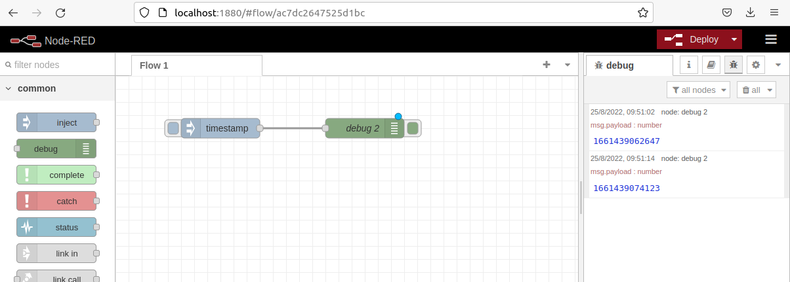

# flw1-NodeRed

# Requisitos previos
Para que este flow funciones, debes de cumplir con los siguientes requisitos:
Instalar node.js

Puedes usar el siguiente comando en ubuntu, para instalar lo ncesario:

$sudo apt install curl

$curl -fsSl https://deb.nodesource.com/setuo_lts.x | sudo -E bash .

# Instrucciones de instalación
Una vez ejecutado esto, necesitas ahora instalar node.js
$sudo apt-get install -y nodejs

Necesitas ademas instalar caracteristicas extras
$sudo apt-get install -y buld-essential

# instalar node-red

$sudo npm install -g --unsafe-perm node-red

# Ejecución de node red

$node-red

# Abrir el servicio de node-red en navegador

Los pasos que tienes que seguir son los siguientes:
Abre tu navegador favorito
E introduce la siguien url http://localhost:1880

